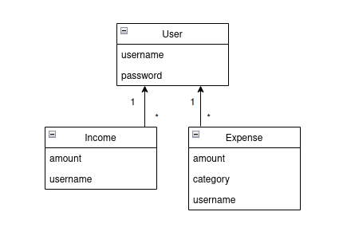
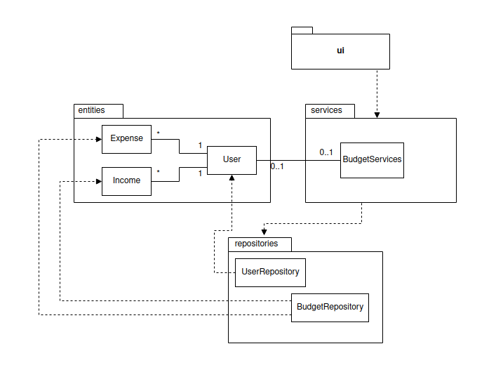
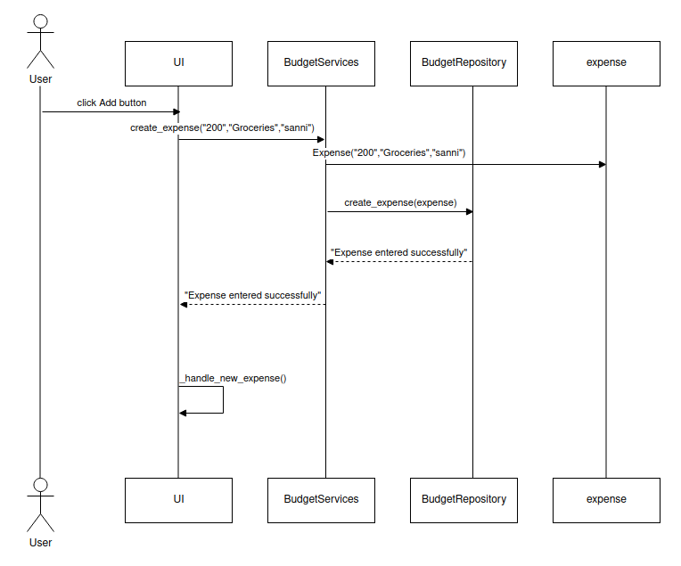
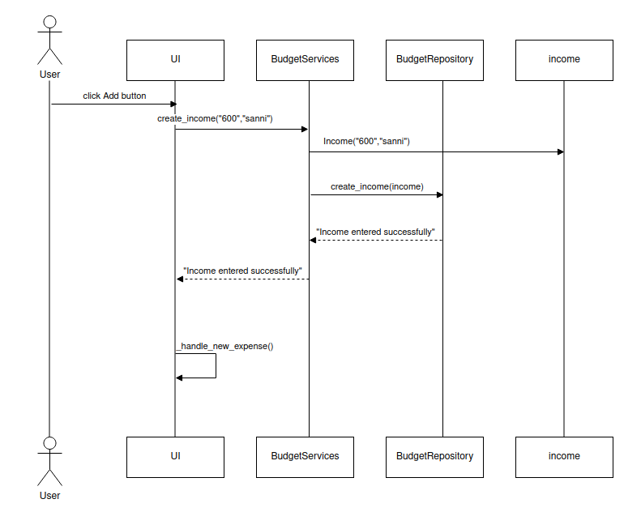

# Arkkitehtuuri

## Rakenne
Ui sisältää tiedostot, jossa ovat kirjautumissivu, uuden käyttäjän luontiin tarkoitettu sivu, tulojen ja menojen kirjaamissivu sekä sivu, jossa on yhteenveto tuloista ja menoista eli ui vastaa käyttöliittymästä. Services vastaa sovelluslogiikasta ja repositories vastaa koodista, jolla tallennetaan tietoja tietokantaan. Entities sisältää tiedostot, joissa oleva koodi kuvastaa käyttäjän sekä tulojen ja menojen muotoa.

## Sovelluslogiikka
Sovelluksen luokka User kuvaa käyttäjiä, Expense menoja ja Income tuloja. Nämä luokat kertovat, mitä tietoja sovelluksessa tallennetaan tietokantaan. Sovelluksen tietomalli näyttää siis seuraavalta:

Itse sovelluksen toiminnot ovat `BudgetServices`-luokassa, jossa on eri metodit jokaiselle toiminnolle. Nämä toiminnot ovat:
- `create_user`
- `login`
- `get_current_user`
- `create_expense`
- `create_income`
- `log_out`

UserRepository ja BudgetRepository vastaavat tietojen tallentamisesta tietokantaan niiden omiin alustettuihin tietokantatauluihin. `BudgetServices` taas saa käyttäjiin sekä tuloihin ja menoihin liittyvät tiedot UserRepositoryn ja BudgetRepositoryn avulla.
Sovelluksen eri osien suhdetta voidaan kuvata seuraavalla pakkauskaaviolla:

## Käyttöliittymä
Sovelluksessa on neljä näkymää:
1. Sisäänkirjautumisnäkymä
2. Uuden käyttäjän luomisnäkymä
3. Sovelluksen aoitus- eli kotinäkymä
4. Uusien tulojen ja menojen kirjaamisnäkymä

## Toimintalogiikka

### Luodaan uusi käyttäjä
Sovellus toimii alla olevan sekvenssikaavion mukaan, kun uuden käyttäjän luomisikkunassa käyttäjä syöttää oikeanlaisen käyttäjätunnuksen ja salasanan ja painaa *CREATE USER* -nappia.

*CREATE USER* -napin painaminen kutsuu `BudgetServices` luokan `create_user` metodia ja parametreiksi ottaa käyttäjän syöttämät tiedot. `UserRepositoryn` avulla selvitetään onko käyttäjänimi käytössä ja jos ei ole, luodaan käyttäjä `User`-oliona ja tallettaa sen tietokantaan `UserReporitoryn` metodilla `create`. Seuraavaksi käyttöliittymä vaihtaa näkymäksi kirjautumisikkunan ja käyttäjä voi kirjautua sovellukseen luomallaan käyttäjätunnuksella ja salasanalla.

### Kirjaudutaan sovellukseen
Sovellus toimii alla olevan sekvenssikaavion mukaan, kun kirjautumisikkunassa käyttäjä syöttää käyttäjätunnuksensa ja salasanansa ja painaa *LOG IN* -nappia.

*LOG IN* -napin painaminen kutsuu `BudgetServices` luokan `login` metodia ja parametreiksi ottaa käyttäjän syöttämät käyttäjätunnuksen ja salasanan. `UserRepositoryn` avulla selvitetään onko käyttäjänimi olemassa ja täsmääkö salasanat. Jos käyttäjä löytyy ja salasana on oikein, käyttäjä kirjataan sisään ja käyttöliittymä vaihtaa näkymäksi budget-appin aloitus- eli kotisivun.

### Luodaan uusi kulu
Sovellus toimii alla olevan sekvenssikaavion mukaan, kun tulojen ja kulujen kirjaamisikkunassa käyttäjä valitsee pudotusvalikosta kategorian, syöttää kulun määrän ja painaa *Add* -nappia.

*Add* -napin painaminen kutsuu `BudgetServices` luokan `create_expense` metodia ja parametriksi ottaa määrän, kategorian ja käyttäjätunnuksen. Uusi kulu luodaan ja käyttöliittymä kutsuu uudestaan tulojen ja kulujen kirjaamisikkunaa.

### Luodaan uusi tulo
Sovellus toimii alla olevan sekvenssikaavion mukaan, kun tulojen ja kulujen kirjaamisikkunassa käyttäjä syöttää tulos määrän ja painaa *Add* -nappia.

*Add* -napin painaminen kutsuu `BudgetServices` luokan `create_income` metodia ja parametriksi ottaa määrän ja käyttäjätunnuksen. Uusi tulo luodaan ja käyttöliittymä kutsuu uudestaan tulojen ja kulujen kirjaamisikkunaa.

