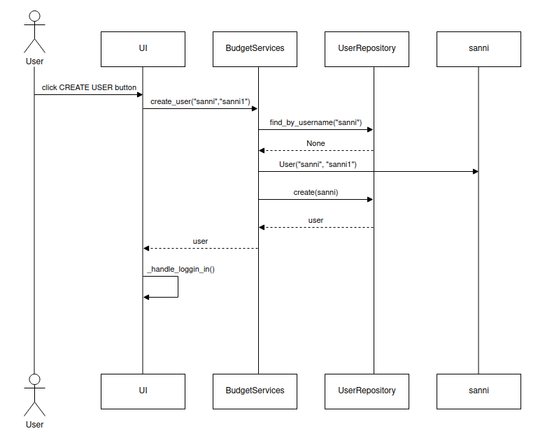

# Arkkitehtuuri

## Rakenne
Ui sisältää tiedostot, jossa ovat kirjautumissivu, uuden käyttäjän luontiin tarkoitettu sivu, tulojen ja menojen kirjaamissivu sekä sivu, jossa on yhteenveto tuloista ja menoista eli ui vastaa käyttöliittymästä. Services vastaa sovelluslogiikasta ja repositories vastaa koodista, jolla tallennetaan tietoja tietokantaan. Entities sisältää tiedostot, joissa oleva koodi kuvastaa käyttäjän sekä tulojen ja menojen muotoa.

## Toimintalogiikka

### Luodaan uusi käyttäjä
Sovellus toimii alla olevan sekvenssikaavion mukaan, kun uuden käyttäjän luomisikkunassa syötetään oikeanlainen käyttäjätunnus ja salasana.

CREATE USER-nappi kutsuu create_user metodia ja parametreiksi käyttäjän syöttämät tiedot. UserRepositoryn avulla selvitetään onko käyttäjänimi käytössä ja jos ei ole, luodaan käyttäjä User-oliona ja tallettaa sen tietokantaan UserReporitoryn metodilla create. Seuraavaksi käyttöliittymä vaihtaa näkymäksi kirjautumisikkunan ja käyttäjä voi kirjautua sovellukseen luomallaan käyttäjätunnuksella ja salasanalla.

