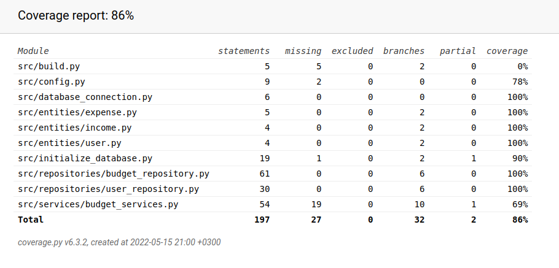

# Testaus
- `tests`- kansiossa on tiedosto `test.py`, jossa on useita testejä `UserRepository` ja `BudgetRepository` luokille sekä myös muutama testi
`BudgetServices` luokan metodeille liittyen käyttäjän kirjautumiseen.
- Testin testaavat
  - käyttäjän, tulojen sekä kulujen luontia
  - käyttäjän, tulojen sekä kulujen hakemista
  - tulojen ja kulujen yhteissumman hakemista
  - kulujen yhteissumman hakemista kategorioittain
  - kaikkien käyttäjän tulojen ja kulujen poistamista
  - käyttäjän luomista jo käytössä olevalla käyttäjätunnuksella
  - kirjautumista väärällä käyttäjätunnuksella
  - kirjautumista väärällä salasanalla
 - Testauksessa käytetään erillistä SQLite-tietokantaa

## Testikattavuus

Testikattavuus on 86%
